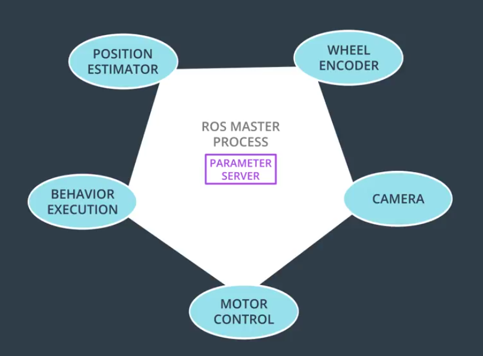

# ROS
## 组成
ROS主要有一个ROS MASTER PROCESS，这个进程记录了ROS里面的每个nodes，并且维护一个PARAMETER SERVER储存可以被各个nodes获得的参数
  
不同nodes之间通讯遵循发布者订阅者模式，一个node能发布不同topics的messages，也能接收多个topics的messages。ROS里面预定义了很多messages  
同时不同于topic是n-n，ROS还提供1-1的services
## 工具
将nodes之间关系可视化的RQT Graph
## 流程
首先在一个terminal里面运行rosrun，然后再多打开几个terminal，依次运行nodes
## 常见指令
rosnode list能显示现在正在运行的nodes的名字
rostopic能获得某个topic的信息，  
i.e.rostopic info /turtle1/cmd_vel  
i.e.rostopic echo /turtle1/cmd_vel 当发布某个topic的msg的时候会打印出来  
rosmsg能获得某个msg的信息，i.e.rosmsg info geometry_msgs/Twist
## 创建工作区
catkin应该是ROS里面的一种工作环境，不知道未来会不会用上别的工作环境，但是我看很多教程都用的catkin环境，这个环境下估计集成了很多方便的命令
cd ~/catkin_ws/src
catkin_init_workspace
cd ~/catkin_ws
catkin_make
## 目录结构
```
scripts (python executables)
src (C++ source files)
msg (for custom message definitions)
srv (for service message definitions)
include -> headers/libraries that are needed as dependencies
config -> configuration files
launch -> provide a more automated way of starting nodes

Other folders may include

urdf (Universal Robot Description Files)
meshes (CAD files in .dae (Collada) or .stl (STereoLithography) format)
worlds (XML like files that are used for Gazebo simulation environments)
```
## 添加packages
packages在前面的介绍里面也都没有提起过，我估计是一个包含了很多nodes的文件夹
## 创建packages
```
cd ~/catkin_ws/src  
catkin_create_pkg <your_package_name> [dependency1 dependency2 …]  
```
## build packages
```
cd ~/catkin_ws  
catkin_make  
```
在build的过程中如果遇上package缺失可以通过  
```
apt-get install  
```
或者  
```
source devel/setup.bash  
```
来补齐缺失的package
## launch
```
cd ~/catkin_ws
catkin_make
source devel/setup.bash
roslaunch simple_arm robot_spawn.launch
```
## 自己写nodes
