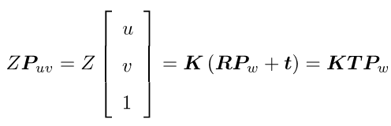
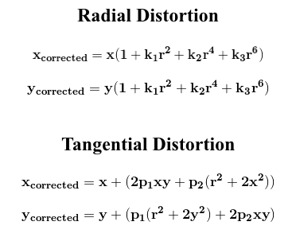
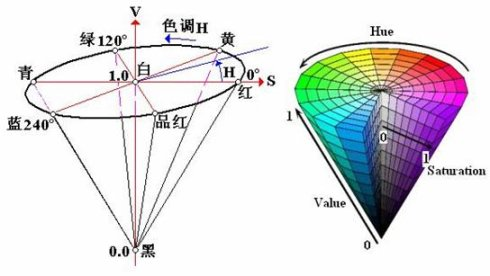

# Calibration, Filtering and Segmentation
## Calibration
首先介绍相机原理，相机拍出来的照片存在径向畸变(radial distortion)和切向畸变(tangential distortion)。
照片上面的任何一个点都可以看作一个到相机中心的矢量。径向畸变是沿这个矢量方向，也就是沿着长度方向发生的畸变。切向畸变是沿着和矢量垂直的方向，也就是角度方向发生的畸变。

### 相机模型公式：[具体解释](http://www.sohu.com/a/272093820_100007727)  

解释中介绍fx,fy分别是x,y方向焦距，一般都是相等的, cx,cy是光心位置，一般是长和宽的一半，他们都叫内参。其中R，t是外参。外参是用来将世界坐标系转化为相机坐标系，[具体解释](https://www.cnblogs.com/wangguchangqing/p/8126333.html)
### 相机畸变原因：[具体解释，跟上面的链接一样](http://www.sohu.com/a/272093820_100007727)  

我们发现公式中的畸变纠正公式和畸变公式是一样的，应该是由于径向畸变和畸变纠正的原理是一样的吧。都只和距离r的二次方四次方六次方有关，所以与其用复杂的公式，还不如通过校准，得出畸变系数，然后弄回来。
### 校准的方法
用来帮助校准的校准图片(Calibration Pattern)很多，我们主要看Udacity里面介绍的棋格校准的方法.
首先从各个角度给校准图片拍照，然后通过调用特定函数，让OpenCV自动寻找棋盘的各个格子

## Filtering
滤波分两种带有采样性质的滤波和有的放矢的滤波
### 采样性质的滤波[^1]
RGB-D相机有大量的点，但是即便把所有点都用上往往对结果没有什么改善，我们可以通过下采样(Downsampling)来让计算加速并且保持一样的效果。  
Udacity在课程中介绍的方式叫VoxelGrid[^2] Downsampling Filter。  

[^1]: https://zhuanlan.zhihu.com/p/54345139  
[^2]: VoxelGrid这个东西是啥呢?翻译过来叫体素。对应的名字是图像里面的像素。像素就是2d图像里面的最小的单元。那么体素就是3d点云的最小单元。‘我的世界’这个游戏不知道大家知不知道。如果这个游戏是一个点云集，那么这个游戏里面的每个小格子就是每一个体素
### 有的放矢的滤波[^3]
如果已经知道目标的特征，就可以根据这个特征，把不要的点剔除。Udacity里面介绍的为直通滤波(Pass Through Filtering)，在课程中统一滤掉了Z轴高度在桌子高度以下的物体

[^3]: https://zhuanlan.zhihu.com/p/54345510
## Segmentation
Segmentation是从点云中找到目标物体。  
Udacity里面介绍的方法是RANSAC，这个算法通过判断数据是否匹配模型来决定是否是我们需要的点，需要的点叫inliers，不需要的叫Outliers。
RANSAC的一个缺点是没有设置上限时间，我们可以通过将RANSAC的模型设置为平面将地板筛选出来后去掉，然后再在剩下的物体中用RANSAC算法寻找目标，能加快速度
步骤为通过RANSAC找到特征，通过ExtractIndices Filter找到桌子，然后留下不是桌子的部分

# Clustering for Segmentation
## K-means Clustering
在已知有多少个类的情况下，重复将每个点划分到最近的中心，然后更新中心位置到所分配的点的中心，然后往复直到不再有变化或者到达更新次数上限
## Euclidean Clustering
也被称作DBSCAN算法(Density-Based Spatial Clustering of Applications with Noise)，被称作Euclidean Clustering是因为使用的是欧几里得距离。  
在不确定有多少类的情况下，https://blog.csdn.net/huacha__/article/details/81094891  

# Object Recognition
虽然RGB是比较有名的表达方式，但是相同的颜色在不同强度的光源下RGB的值不同，所以才有了HSV的表达方式。这是什么颜色(Hue)？深浅如何(Saturation)？明暗如何(Value)？  
  
我们可以用直方图作为特征使用SVM来识别物体
