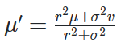
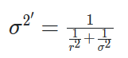
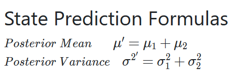
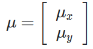
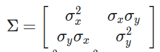
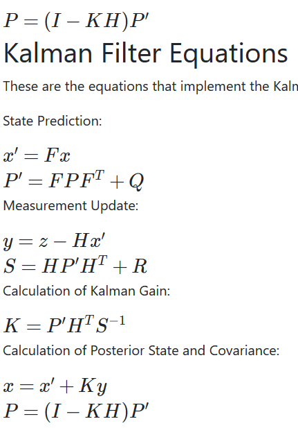
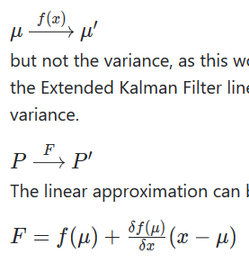

# Introduction to Localization
常见算法为Extended Kalman Filters(EKF)，Markov Localization，Grid Localization 和 Monte Carlo Localization(Paritcle Filter)(MCL)，本章主要介绍EKF和MCL
Localization常见的问题，Position Tracking，Global Localization和 Kidnapped Robot.
Kalman Filters(KF)能分为三类，KF(linear)，EKF(nonlinear)，UKF(无损卡尔曼滤波)(highly nonlinear)，本章就介绍前两个
  
## 一阶高斯  
### Measurement Update  
  
  
  
### State Prediction  
  
  
## 二阶高斯  
  
  
  
## Extended Kalman Filter  
对于非线性系统，更新means和covariance  
高斯分补经过非线性系统更新过后会变成非常复杂分布。means可以通过非线性函数来计算，但是经过非线性系统转换covariance不能再通过一个数表示。所以covariace要通过另外的方式来计算。我们可以通过在极小范围内线性的方法来估算。极小范围内线性的计算方法为泰勒级数。  
  

# Monte Carlo Localization
相比于EKF的优点  
  
算法的思路就是假设现在图中有很多的粒子，粒子的初始位置可以以高斯分布分布在我们认为的位置的附近，每个粒子都做跟目标物体相同的动作。然后根据传感器信息，计算权重，根据权重进行resample，这里的重点是这个行为不是筛选，而是重新挑选，筛选是100个中选50个这样子，但是这里是100个选100个，所以权重高的会有很多重复的。
## resample
resample的方法是像是转转盘一样，将每个点按照概率大小铺在转盘上，每次只能转(0~2*最大概率点)的概率，转完了取一个，取到跟原本个数一样的点后就停止。优达学城中介绍的更加生动。
