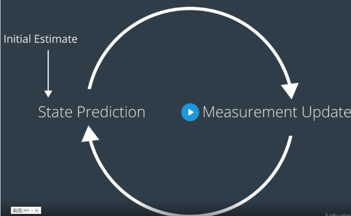

# Introduction to Localization
常见算法为Extended Kalman Filters(EKF)，Markov Localization，Grid Localization 和 Monte Carlo Localization(Paritcle Filter)(MCL)，本章主要介绍EKF和MCL
Localization常见的问题，Position Tracking，Global Localization和 Kidnapped Robot.
Kalman Filters(KF)能分为三类，KF(linear)，EKF(nonlinear)，UKF(无损卡尔曼滤波)(highly nonlinear)，本章就介绍前两个，下图为定位的流程，定位只有两个步骤Measurement Update和State Prediction，我们先生成一个初始估计作为一开始的state prediction，然后获取传感器数据对当前状态进行估计(Measurement Update)，然后用模型比如说运动学估计下一个状态(state prediction)。然后依次循环。  
  
## 一阶高斯  
我们从最简单的一阶高斯作为例子，来过一遍卡尔曼滤波的基本流程。
### Measurement Update  
这一步我们需要根据传感器数据来估计我们当前状态。由于我们的传感器传上来的数据都是具有噪声的，我们假设传感器的噪声符合高斯分布的，所以传上来的数据就如下图中紫色的线Measurement，是个高斯分布。而我们对我们当前状态的估计也不是准确的，而这个不准确程度我们也假设为符合高斯分布的，就是下图中黄色的线Prior Belief。然后我们需要结合Measurement和Prior Belief获取一个靠谱的估计就是Posterior。  
  
也就是说我们要根据Measurement和Prior Belief提供的均值和方差求出Posterior的均值和方差，我们可以用如下公式来求  
$$
\mu' = \frac{r^2 \mu + \sigma^2 v}{r^2 + \sigma^2} = \frac{r^2 \mu + \sigma^2 \mu - \sigma^2 \mu + \sigma^2 v}{r^2 + \sigma^2} = \mu + \frac{\sigma^2(v-\mu)}{r^2 + \sigma^2}
$$
$$
\sigma'^2 = \frac{1}{\frac{1}{r^2}+\frac{1}{\sigma^2}}=\sigma^2 - \frac{\sigma^4}{\sigma^2 + r^2}
$$
当我们假设$k=\frac{\sigma^2}{\sigma^2+r^2}$上面的公式就能简化为
$$
\mu' = \mu + k(v-\mu)
$$
$$
\sigma'^2 =\sigma^2 - k\sigma^2
$$
这个k就是我们说的卡尔曼增益。
### State Prediction  
State Prediction的作用就如上面说的，我们需要估计下一个状态，比如说我们是匀速直线运动，我们从Measurement update当中得到我们位置在1m处，每次更新间隔为1s，速度为1m/s，我们就能估计下一个位置我们在2m处。就如下图从Measurement Update当中我们得到目前位置为27.5处，不确定程度为2.25。经过运动，下一次状态大概会往前走7.5，不确定程度为5。那么新的状态估计，我们能用如下公式估计：
$$\mu' = \mu_1 + \mu_2$$  
$$\sigma'^2 = \sigma_1^2 + \sigma_2^2$$  
  
## 二阶高斯  
现在我们扩展到高阶的情况，不仅仅需要将上面的单变量转成公式形式，还有一些别的因素要考虑进去。首先需要注意的是从低阶变成高阶不是说从一维数轴变成二维平面或者三维立体，而是从单变量到多个可能**互相相关**的变量。比如一阶里面举得例子状态只有当前位置，二阶里面的例子当前位置和速度。  
二阶高斯的示意图如图  
  
### State Prediction  
我们定义x为当前状态，F为状态转换矩阵，B为外部影响。公式如下  
$$\widehat{x}_k = F_k \widehat{x}_{k-1} + B_k \widehat{u}_k + w_k$$
这个公式就是一阶中的$\mu' = \mu_1 + \mu_2$，这里$w_k$表示的是外部不确定因素对机器人造成的影响$w_k$服从高斯分布$N(0,Q_k)$，所以这里$w_k$为0，很多文档就把这一项省略掉了。但是如果明确知道均值不为零的是时候，就需要注意了。  
像上面的例子当中仅仅考虑位置，那么速度就是外力，这里方程就是$x_k = 1 * x_{k-1} + 7.5 * 1 + 0$。这里要是我们状态选择为位置和速度两个参数，我们就没有外部影响了，所以$B_k=0$可以这么列
$$
\widehat{x}_k = 
\begin{bmatrix}
 1& \Delta t\\ 
 0& 1
\end{bmatrix} \widehat{x}_{k-1}
$$
要是要将加速度考虑进去
$$
\widehat{x}_k = 
\begin{bmatrix}
 1& \Delta t\\ 
 0& 1
\end{bmatrix} \widehat{x}_{k-1} + 
\begin{bmatrix}
\frac{\Delta t^2}{2} \\
\Delta t
\end{bmatrix} a
$$
上面就是对均值的更新，接下来我们要对方差进行更新。因为
$$Cov(x)=\Sigma $$
$$Cov(Ax)=A \Sigma A^T$$  
我们可以得到协方差更新公式$P_k = F_k P_{k-1} F_k^T$  
在一阶的情况，因为A=1所以不需要这个公式。  
由于肯定存在我们无法预测的外力，比如无人机在空中飞的时候受的风力，所以协方差的更新我们也要考虑噪声，我们这里添加了一个$Q_k$作为不确定的影响。在一阶的例子中就是$\sigma^2=5$  
然后下面这两个公式就是在高阶的情况下，State Prediction的公式  
$$\widehat{x}_k = F_k \widehat{x}_{k-1} + B_k \overrightarrow{u}_k+w_k$$  
$$P_k = F_k P_{k-1} F_k^T + Q_k$$  

### Measurement Update  
根据一阶的经验，我们需要先求出卡尔曼系数$k=\frac{\sigma^2}{\sigma^2+r^2}$。首先我们需要考虑读数的规模和状态的规模不一定相同，比如读数的单位是cm，但是状态的单位是m，这时候就需要一种关系将状态量转换为我们期望的传感器读数。$\overrightarrow{z}_{expected}=H_k \widehat{x}_k$，H就是这个转换关系。再根据$Cov(Ax)=A \Sigma A^T$这个公式，一阶的$\sigma^2+r^2$变为多阶的$H P_k H^T + R$。然后卡尔曼增益则变成
$$K=H P_k H^T (H P_k H^T + R)^{-1}$$  
得到了卡尔曼增益，我们现在先来求均值，我们设$\overrightarrow{z}_k$为传感器读数，根据一阶更新均值的公式$\mu' = \mu + k(v-\mu)$，我们能得到高阶的均值更新公式
$$H \widehat{x'}_k = H \widehat{x}_k + K(\overrightarrow{z}_k - H \widehat{x}_k)$$  
大部分资料会写成这样
$$y_k = H \widehat{x}_k + K(\overrightarrow{z}_k - H \widehat{x}_k)$$
然后根据一阶更新方差的公式$\sigma'^2 = \sigma_1^2 + \sigma_2^2$，我们能得到高阶的方差
$$H P'_k H^T = H P_k H^T - K H P_k H^T$$  
#### 精简版本 Measurement Update
我们可以将这三个公式再精简一下，我们设一个新的卡尔曼增益  
$$
K = H K' = H (P_k H^T (H P_k H^T + R)^{-1})
$$
则将均值方差更新公式用K'表示
$$
\widehat{x'}_k = \widehat{x}_k + K'(\overrightarrow{z}_k - H \widehat{x}_k)
$$
$$
P'_k = P_k - K' H P_k
$$
### 具体实现
工程上面会需要检查噪声是否满足高斯白噪声，我们把上面$\overrightarrow{z}_k - H \widehat{x}_k$称为新息，我们通过对新息进行卡方检测，来判断，[检测思路](https://blog.csdn.net/lmmmmmmmm/article/details/88121772)  

## Extended Kalman Filter  
对于非线性系统，更新means和covariance  
高斯分补经过非线性系统更新过后会变成非常复杂分布。means可以通过非线性函数来计算，但是经过非线性系统转换covariance不能再通过一个数表示。所以covariace要通过另外的方式来计算。我们可以通过在极小范围内线性的方法来估算。极小范围内线性的计算方法为泰勒级数。EKF跟KF唯一的不同就在于此，我们的H和F是通过泰勒级数来更新的。  
用公式理解就是KF是
$$x_k= A_k x_{k-1} + B_k u_k + w_k$$
$$y_k = H_k x_k + v_k$$
现在EKF是
$$x_k= f_k(x_{k-1},u_k) + w_k$$
$$y_k = h_k(x_k) + v_k$$
我们在EKF中先求一阶雅可比矩阵，然后求h_k和f_k中的一阶泰勒公式。具体实现看代码。

# Monte Carlo Localization
相比于EKF的优点  
  
算法的思路就是假设现在图中有很多的粒子，粒子的初始位置可以以高斯分布分布在我们认为的位置的附近，每个粒子都做跟目标物体相同的动作。然后根据传感器信息，计算权重，根据权重进行resample，这里的重点是这个行为不是筛选，而是重新挑选，筛选是100个中选50个这样子，但是这里是100个选100个，所以权重高的会有很多重复的。
## resample
resample的方法是像是转转盘一样，将每个点按照概率大小铺在转盘上，每次只能转(0~2*最大概率点)的概率，转完了取一个，取到跟原本个数一样的点后就停止。优达学城中介绍的更加生动。

---
参考资料[1]:https://zhuanlan.zhihu.com/p/39912633
参考资料[2]:https://www.cnblogs.com/zhoug2020/p/7619989.html
参考资料[3]:https://www.jianshu.com/p/f6ce8943560c?from=singlemessage
参考资料[4]:https://blog.csdn.net/lmmmmmmmm/article/details/88121772