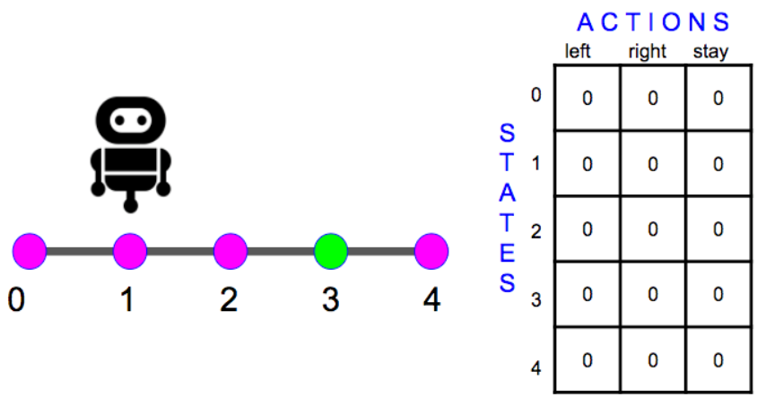
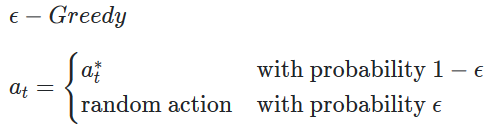
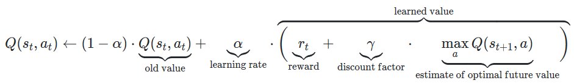

# Q-Learning
首先初始化一张在某个state采取某个action期望的reward的Q-Learning表

有两种初始化方法，一种都初始化为0，一种是初始化为很大的值
在判断采取什么行为的时候有两种策略，一种是Exploration，一种是Exploitation。Exploitation是根据已知信息选择期望值最大的那个action，Exploration是随机选择一个action。因为我们不知道这个期望的由来是因为卡在某个解里面还是真的是最优解，所以除了选择目前最优解之外，我们还需要尝试别的action。所以我们在选择action的时候，有一定概率会进行Exploration一定概率会Exploitation

流程就是根据Q-Learning的公式不断更新Q-Learning表然后选择最优的解

