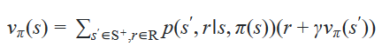

强化学习有三个[步骤](./img/structure.png)，其中observation也叫state是下图流程中的S，action是A，reward是R，强化学习的流程
强化学习的任务分为两种：突发性(episodic)任务和持续性(continuing)任务，前者有明确的相应，后者没有
agent目标是获得累计奖励的最大化，累计奖励(Cumulative Reward)不仅仅需要关注过去的奖励还需要关注未来可能获得的奖励，但是未来是否能获得奖励是不知道的，所以会有个Discounted Rate $\gamma$来表达对未来的关注度，$\gamma$一般取(0,1)，不取1是因为结果会是无限无法计算，一般会取一个比较靠近1的值而不是靠近0的，否则会造成机器人太过于短视

# Markov Decision Process 马尔可夫决策过程
其实就是把流程画出来，拿其中一个流程图出来    
拿high这个state选择search这个action来说就是，有0.7的可能性回到high然后获得4点reward，然后有0.3的可能性变成low然后获得4点reward，然后把所有可能用graph的方式表达出来。
不过这隐藏着一些前提
当前state和reward只由前一刻的state和action决定,而且agent选择的action不会对环境有影响，
## one-step dynamics
虽然不知道为什么用这个名字，但是这章的核心是，用表达式来表示其中某一步的概率
例子：当前的状态是high，选择search后获得4点奖励下一个状态是high的概率可以用如下表达式来表示  

## policy
agent对state的反应叫做policy，用$\pi$表示，两种policy，一种叫Deterministic Policy，这种policy对于state有固定的action，$\pi(high)$。一种叫Stochastic Policy，这种对于一个state采取哪个action是几率的，$\pi(wait|low)=0.5$。
## State-Value Functions
当处于这个state我们期望的value叫State-Value Function，定义如下

## Bellman Equations
总共有四个公式，但是这里只教了其中一个。某一个状态的期望值等于之后的期望值加上这个行为的reward  
$v_\pi(s) = E_\pi [R_{t+1} + \gamma v_\pi (S_{t+1})| S_{t}=s]$  
然后具体到Deterministic

Stochastic

实际这两个变体就是计算所有可能性而已，就拿上面的例子来举例
现在%state_t% = high，假设我们的$\pi (search|high) = 0.4 \pi (wait|high) = 0.6 \gamma=0.8$那么我们算式是  
$v_\pi(s) = E_\pi [R_{t+1} + \gamma v_\pi (S_{t+1})| S_{t}=s] = \pi(wait|high)*p(high,1 | high,wait)*(1 + \gamma v_\pi(high)) + \pi(search|high)*p(high,4 | high,search)*(1 + \gamma v_\pi(high)) + \pi(search|high)*p(low,4 | low,wait)*(1 + \gamma v_\pi(low))$  
## Optimal policy
最优策略，对于在这个policy下State-Value Functions就是每个state所期望的value都是最大的。用$v_*$表示。对于下面的Action-Value Functions，就是$q_*$  
## Action-Value Functions
定义如下

我们通过选择每个state中Action-Value Functions最大的action来执行，就能获得optimal policy
