# Approaches to Path Planning
## discrete planning
将大地图分成一个个小块然后使用graph-search来寻找最近的路径，这个方法足够准确但是耗时太长  
经过如下流程后才开始使用寻找路径的算法：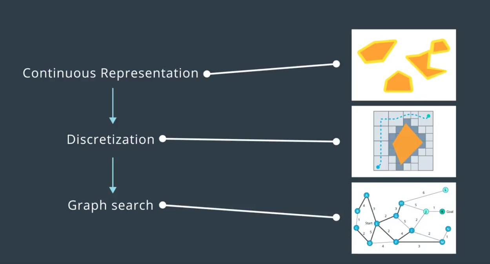
### Continuous Representation
我们需要考虑到现实情况中，机器人往往是有半径的，所以不能简单地将机器人抽象为一个点然后不做任何处理。将半径考虑进去的方法有，不断计算物体到机器人中心点地距离，如果靠近半径的值就是有危险的，但是在周边物体形状不规则而且物体比较多的情况下这个方法不容易计算。所以我们一般是将周围物体膨胀机器人的半径，然后机器人依旧抽象为一个点，如下图
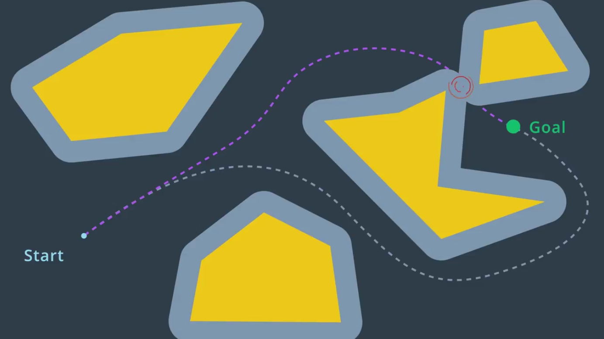  
让物体膨胀的方法的数学学名叫做 闵可夫斯基和 。百度百科的例子讲的很清楚  
闵可夫斯基和是两个欧几里得空间的点集的和，也称为这两个空间的膨胀集。例如，平面上有两个三角形，其坐标分别为A={(1,0),(0,1),(0,-1)}及B = {(0, 0), (1, 1), (1, −1)}，则其闵可夫斯基和为A + B = {(1, 0), (2, 1), (2, −1), (0, 1), (1, 2), (1, 0), (0, −1), (1, 0), (1, −2)}。若推广至流形的连续集，闵可夫斯基和从几何上的直观体现即是A集合沿B的边际连续运动一周扫过的区域与B集合本身的并集。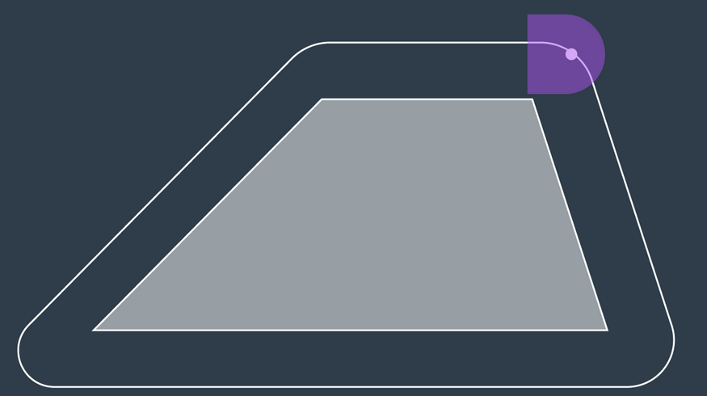
但是当物体角度不同时，膨胀出来的物体形状是不同的。所以这里引进构型空间(3D Configuration Space)的概念，在这个空间里面xy还是xy，但是多出来的z轴是物体的角度，往上升就是顺时针旋转，往下降就是逆时针旋转。为了将所有情况都表达尽，所以有了构型空间。这个视频包含了对构型空间的演示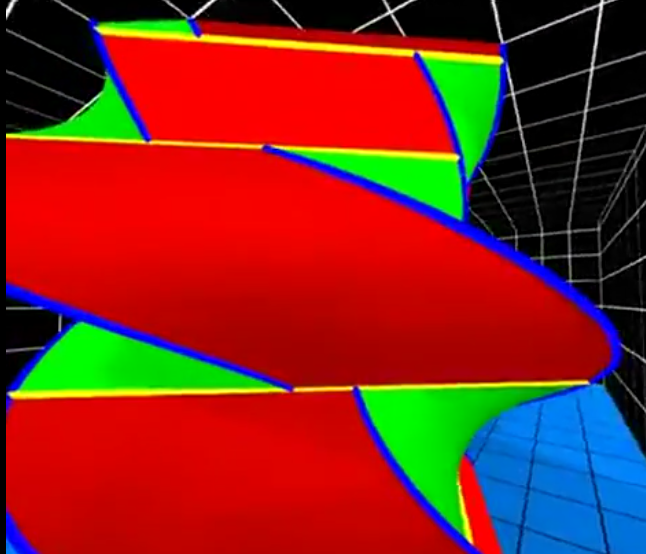
[视频链接](https://tv.sohu.com/v/dXMvNTAzMzMxMDEvNjkzMzIzMDcuc2h0bWw=.html?spm=a2h0k.11417342.soresults.dtitle)  
视频中使用蓝线表示用操控物体的顶点围着障碍物的某个顶点旋转，黄线是用操控物体的边沿着障碍物的某个边平移，红面是指被操控物以操控物体的某一个顶点为圆心进行旋转，绿面是被操控物为以障碍物的某一个顶点为圆心进行旋转。  
不过这个介绍过于复杂了，其实找到能通行的路径就是在构型空间里面找到一条能从起点到终点的路径就可以了。
### Discretization
使用Roadmap的方式来表达构型空间，这个步骤主要有两个方法，Visibility Graph和 Voronoi Diagram，但是后面又接了三种方法，Exact Cell Decomposition , Approximate Cell Decomposition 和 Potential Field
#### Visibility Graph
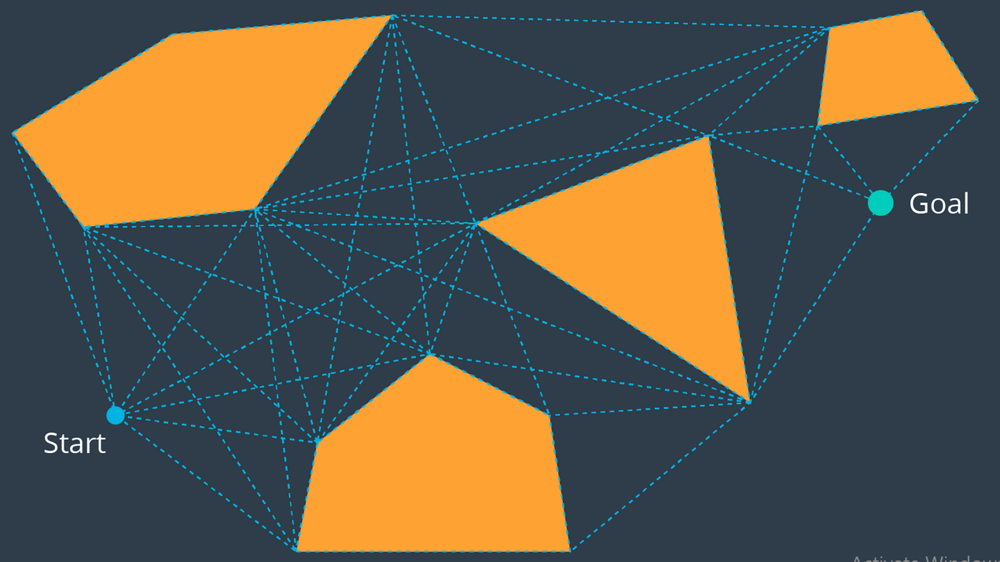
如图，将有穿不过去的障碍物划成多边形，然后每一个点都将所有能“看到”(visible)的点都连起来，每个点都将不用穿过障碍物就能通过直线连接的点都连起来。这个图有个缺点，就是生成的最短路径终究会经过某个障碍物的某个点，然后这个时候是存在碰撞的危险的，游戏世界中使用这个算法无所谓，但是现实生活中运用中不会这么做
#### Voronoi Diagram
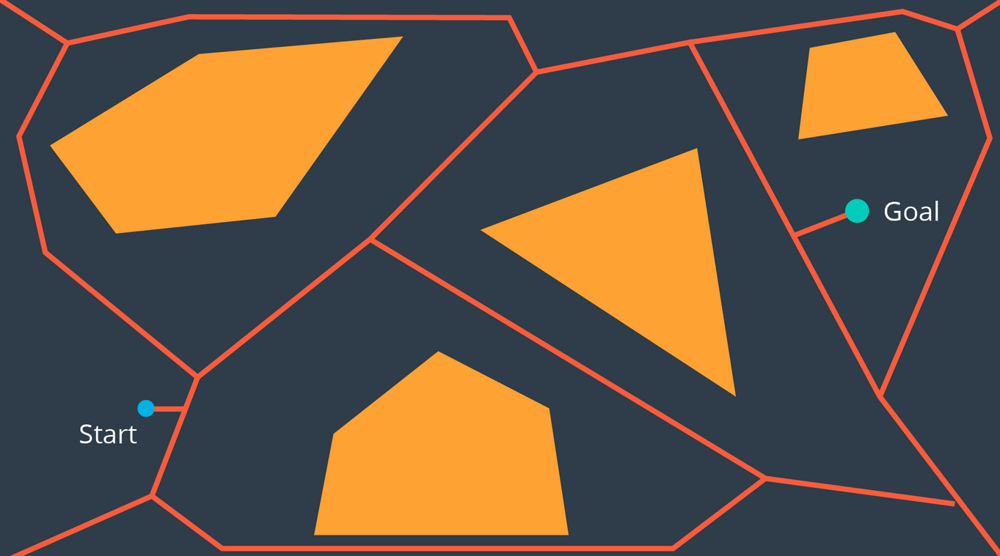
如图，依旧将有穿不过去的障碍物划成多边形，然后两个障碍物中间的线到两个障碍物的距离是相等的。
#### Exact Cell Decomposition
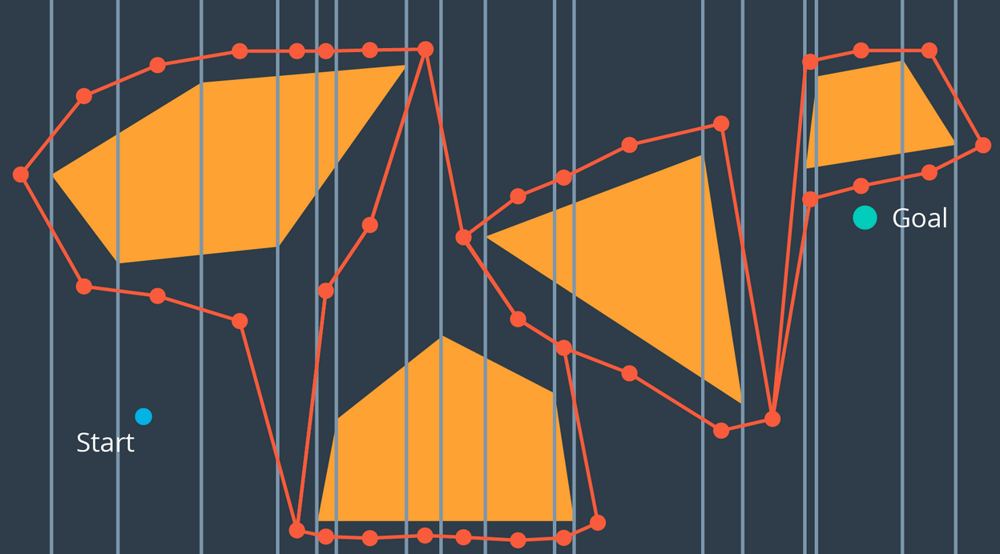
如图，将所有障碍物的角从上往下都划上一条竖线，然后两条竖线之间的障碍物边界线都点上一个点，然后将这些点作为roadmap传下去。但是这个方法不好的地方在于，如果障碍物是多边形的时候，会占用很多计算资源
#### Approximate Cell Decomposition
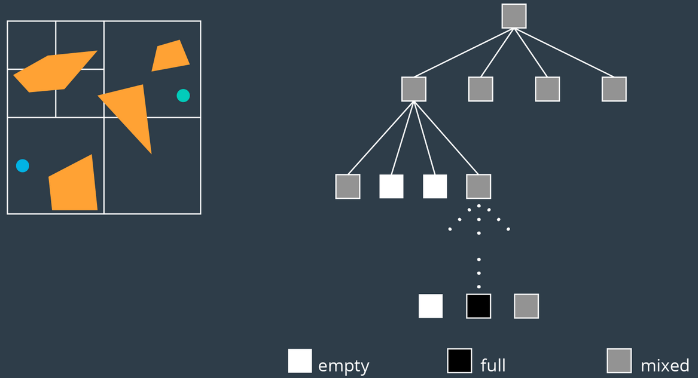
如图，首先将地图四等分，根据有没有障碍物以及障碍物占比分为empty，mixed和full。如果根据empty的格子能规划出路径，那么就直接执行这个路径。如果不行的话，就将mixed的格子继续拆分，然后再次查看是否能规划出路径。一直重复迭代直到能规划出路径。这个方法虽然快，但是有可能没法找到最短的路径。
#### Potential Field
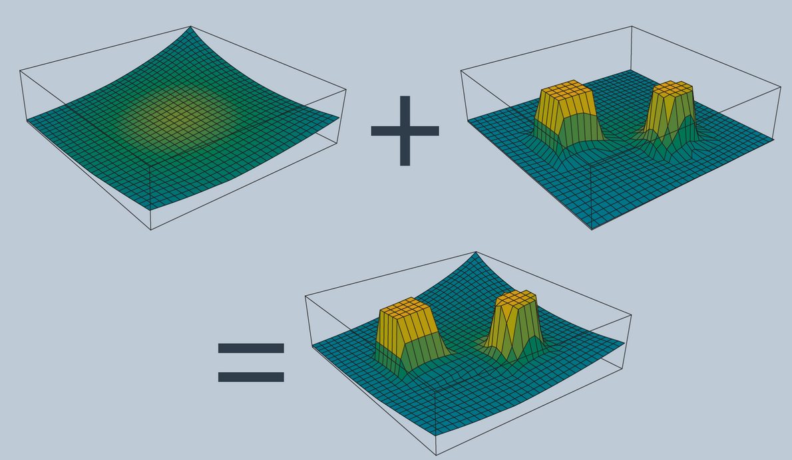
如图，将目标点设置为最低点，然后将障碍物的周边设置排斥函数，然后沿着斜率最低的方向下降
### Graph search
#### Uninformed of the Goal
##### Breadth-First Search
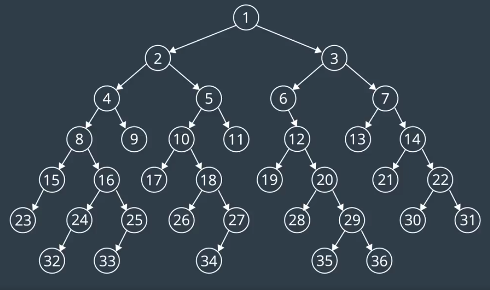
图中的数字表示的是搜索的顺序。首先横向搜索然后纵向搜索。
这个算法平常根本用不到，就是个引子。因为这个算法效率太低了。就如这章例子中说的一样。
#### Depth-First Search
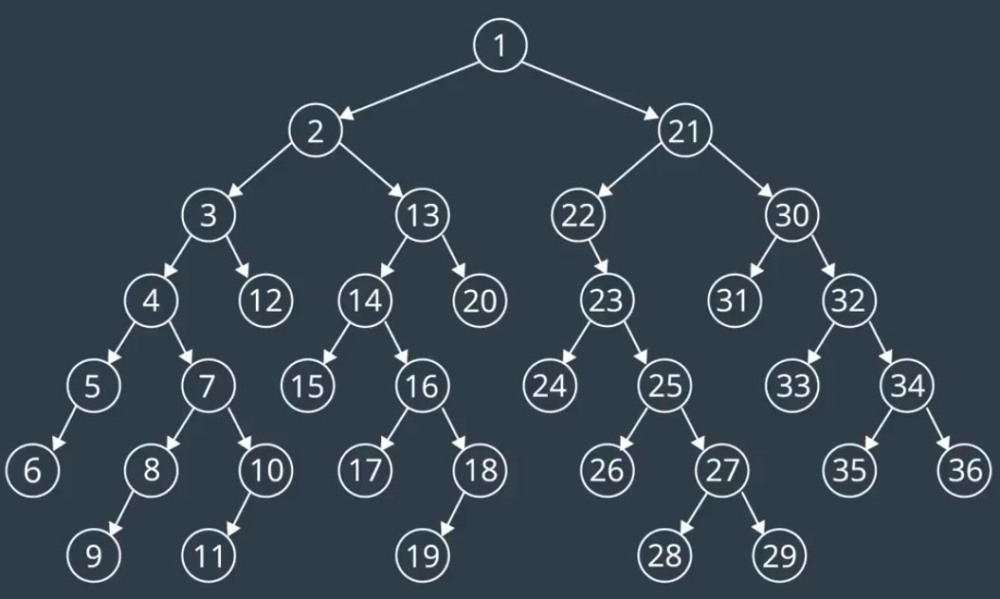
图中的数字表示的是搜索的顺序。首先纵向搜索然后横向搜索。跟上面一样，效率太低，也用不到
#### Uniform Cost Search
上面两种算法都没有考虑到现实情况，现实情况是去探索每个点的cost不一样。这个cost应该根据距离和路况等因素估计。每次探索总cost数一定的值。第一轮为1，之后为2，一直类推。直到找到目标点。
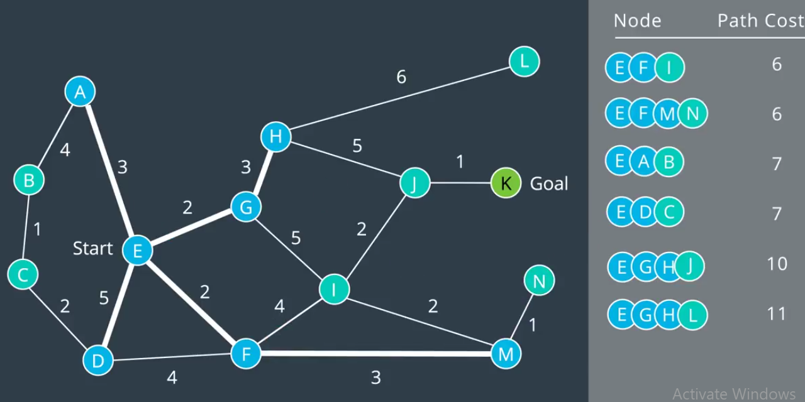
#### Informed of the Goal
##### A*
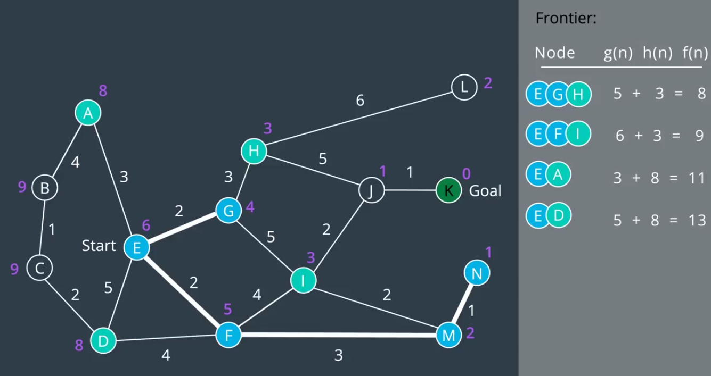
实际上就是Uniform Cost Search加上需要探索点到目标点的距离
## sample-based
这个方法通过采样，用采样点来表达整个地图，虽然不够准确但是速度够快  
我们采用sample-based的方法是因为多维空间里，运动可能性指数级增长，而且物体的运动不是没有限制的。为了提高效率，我们不再要求一定能找到路径并且是最优解。我们只要求可能能找到路径并且是可执行的路径
### Probabilistic Roadmap Method(PRM)
PRM流程如下
```
初始化一个空的图(graph)
循环n次：
    初始化一个点(configuration)
    如果这个点没有和任何障碍物撞上：
        将这个点添加到图中
        找到图中离这个点最近的k个点
        遍历这k个点：
            查看是否有一条直线(edge)将这个点和遍历的点连起来
            连起来的话就把这条直线加到graph里面
```
### Rapidly Exploring Random Tree Method(RRT)
和PRM不同的是，PRM是先构建一个graph表示整个空间然后将起始点和目标点添加进去。RRT从一开始就将起始点和目标点考虑进去，试图建立起始点和目标点的联系，而且用的是tree结构。
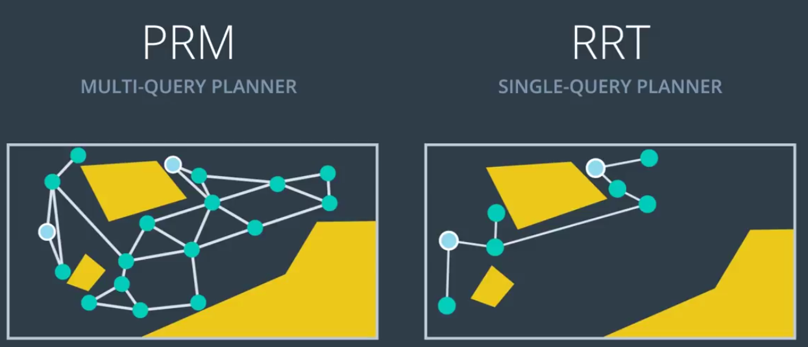
流程如下
```
初始化两个tree
将起始点(start node)添加到tree1
将目标点(goal node)添加到tree2
进行n个循环或者tree1和tree2连接上了：
    每次为不同的树生成一个随机的点
    如果这个随机点没有和障碍物碰撞：
        找到树上和随机点最近的点
        如果最近的点到随机点的距离小于一定距离 $\delta$:
            将最近的点和随机点连起来
        否则
            沿着最近的点和随机点连线上距离最近的点为 $\delta$的地方添加新的点，然后将之前生成的随机点去掉
        尝试将两个tree连起来
```
### Improving method: Path Smoothing
流程如下
```
进行n次迭代：
    从graph当中选择两个节点
    如果两个点直接连接能生成比现有路径更短的路径：
        如果不和障碍物碰撞：
            就将现有的路径用新路径取代掉
```
## probabilistic
这个方法将机器人自身考虑进去，但具体的算法没有说
